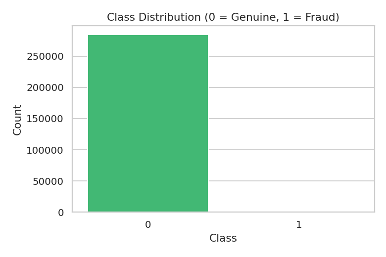
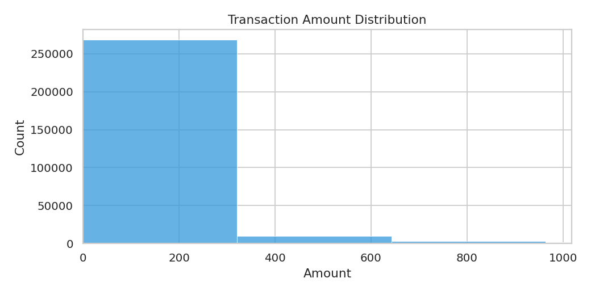
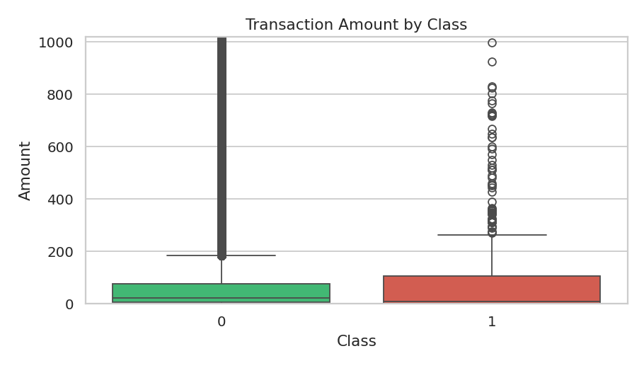
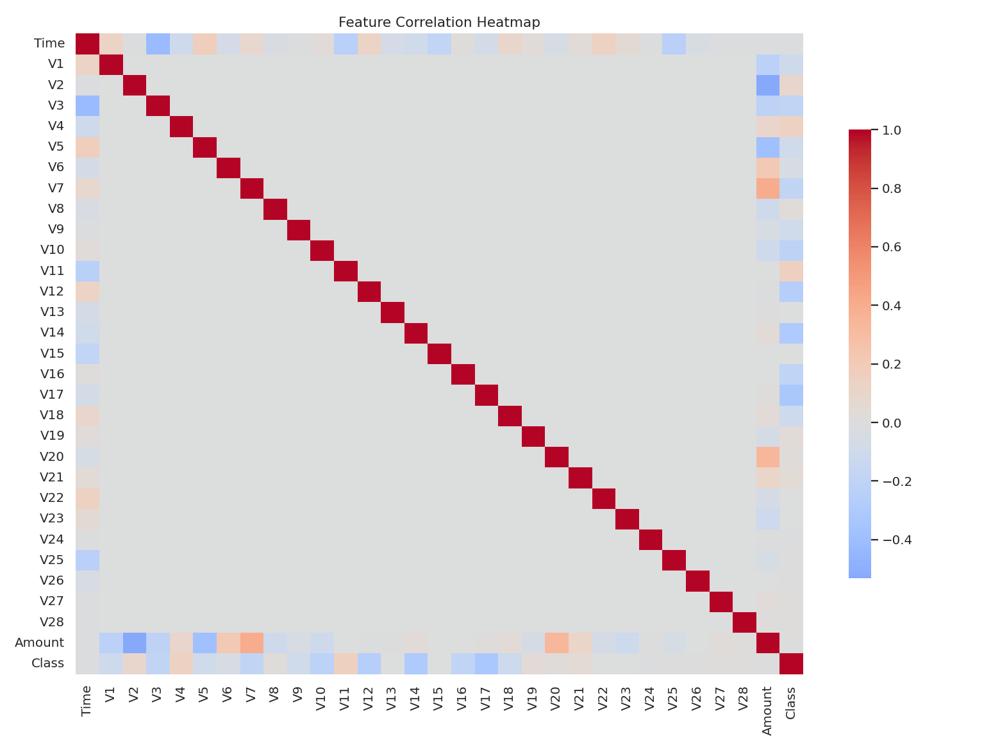
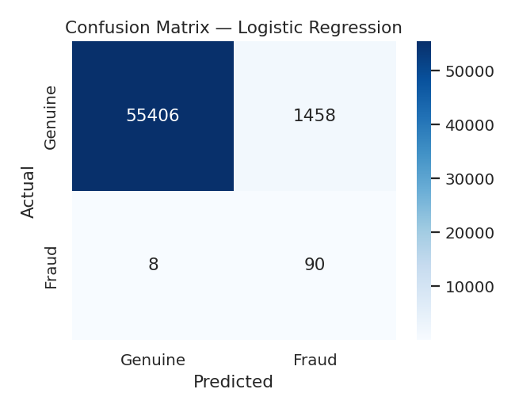
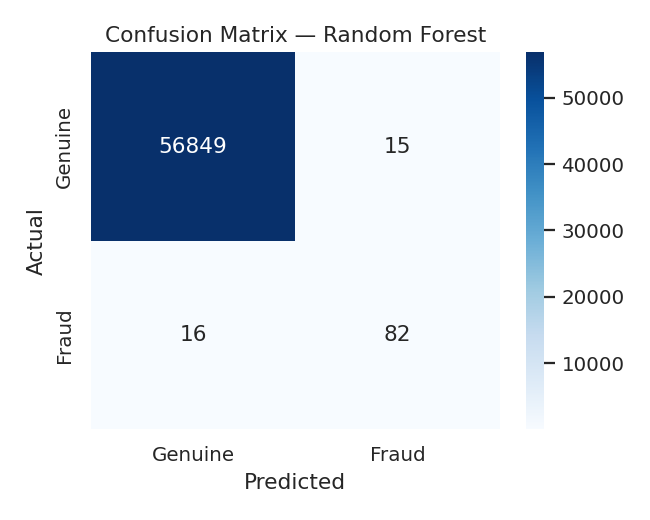
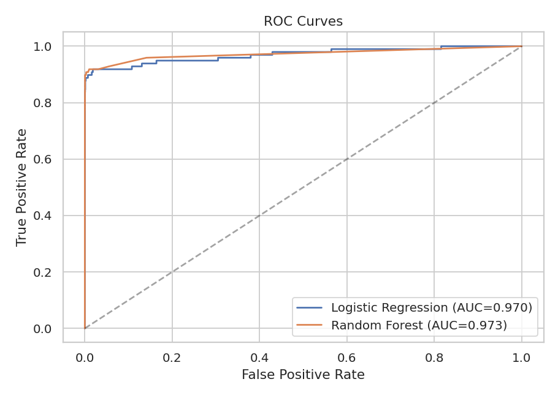

# Credit Card Fraud Detection


<p align="center">
  
  
  
  
  
  
</p>

A complete end-to-end machine learning pipeline that detects fraudulent credit
card transactions on the [Kaggle Credit Card Fraud Detection dataset](https://www.kaggle.com/datasets/mlg-ulb/creditcardfraud)
(284,807 transactions, only **0.17 % fraud** — an extreme class-imbalance
problem).

Built with **scikit-learn**, **imbalanced-learn (SMOTE)**, **pandas**, and
**seaborn**. Random Forest hits **ROC-AUC 0.973** on the held-out test set.

---

## Table of contents

- [Why this project is interesting](#why-this-project-is-interesting)
- [Results](#results)
- [Visualisations](#visualisations)
- [Pipeline](#pipeline)
- [Project structure](#project-structure)
- [Quick start](#quick-start)
- [Run](#run)
- [Business takeaways](#business-takeaways)
- [Roadmap](#roadmap)
- [License](#license)
- [Author](#author)

---

## Why this project is interesting

Credit-card fraud is a textbook **extreme class imbalance** problem: only
**492 of 284,807** transactions are fraudulent (0.17 %). A model that always
predicts "genuine" still scores 99.83 % accuracy and catches zero fraud, so
this project is built around the metrics that actually matter in production:
**recall**, **precision**, **F1**, and **ROC-AUC**.

---

## Results

Evaluated on a held-out test set of **56,962 transactions** (98 fraud).
SMOTE is applied to the **training set only** — the test set keeps the real
production distribution to avoid information leakage.

| Model               | Precision (fraud) | Recall (fraud) | F1 (fraud) | ROC-AUC   |
| ------------------- | ----------------: | -------------: | ---------: | --------: |
| Logistic Regression |             0.058 |      **0.918** |      0.109 |    0.9698 |
| Random Forest       |         **0.845** |          0.837 |  **0.841** | **0.9731** |

**Reading the results:**

- **Logistic Regression** catches 90/98 frauds (91.8 % recall) but raises
  1,461 false alarms — sensible if every alert goes to a cheap human review
  queue.
- **Random Forest** catches 82/98 frauds (83.7 % recall) with only 15 false
  alarms. 84 % of its alerts are real fraud — far more deployable.
- The right operating point depends on the **cost of a missed fraud vs the
  cost of investigating a false positive**. Tune the decision threshold on
  `predict_proba` to slide along the precision-recall curve.

---

## Visualisations

| | |
| :---: | :---: |
|  |  |
| Extreme class imbalance | Transaction amount distribution |
|  |  |
| Amount by class | Feature correlation heatmap |
|  |  |
| Confusion matrix — Logistic Regression | Confusion matrix — Random Forest |
|  | |
| ROC curves for both models | |

---

## Pipeline

1. **Load** `creditcard.csv` (284,807 × 31).
2. **EDA** — class distribution, transaction-amount distribution, amount
   by class, correlation heatmap.
3. **Feature prep** — `Time` and `Amount` standardised with
   `StandardScaler`. V1–V28 are already PCA components and left alone.
4. **Stratified 80/20 split** — `stratify=y` is critical because of the
   0.17 % positive rate.
5. **SMOTE oversampling** — applied **only to the training set** (never
   the test set) to avoid information leakage.
6. **Models** — Logistic Regression and Random Forest.
7. **Evaluation** — full classification report, confusion matrix, ROC-AUC,
   ROC curves.

---

## Project structure

```
Credit-Card-Fraud-Detection/
├── data/
│   └── creditcard.csv          # download from Kaggle (gitignored)
├── notebooks/
│   └── fraud_detection.ipynb   # narrated walkthrough
├── images/                     # generated plots + banner
├── fraud_detection.py          # runnable end-to-end pipeline
├── requirements.txt
├── LICENSE
└── README.md
```

---

## Quick start

```bash
git clone https://github.com/srajasingh/Credit-Card-Fraud-Detection.git
cd Credit-Card-Fraud-Detection
pip install -r requirements.txt
```

Download the dataset from
[Kaggle](https://www.kaggle.com/datasets/mlg-ulb/creditcardfraud) and put
`creditcard.csv` into `data/`.

## Run

Script:

```bash
python fraud_detection.py
```

Notebook:

```bash
jupyter notebook notebooks/fraud_detection.ipynb
```

All plots are written to `images/`.

---

## Business takeaways

- Fraud is ~0.17 % of transactions — **accuracy is the wrong metric**.
- **Recall** is the business priority: every missed fraud is a direct loss.
- SMOTE lets the model learn the minority class without discarding genuine
  data the way undersampling does.
- Random Forest gives the best precision/recall trade-off in this setup
  and is the better production candidate.

---

## Roadmap

Planned upgrades, ordered by impact-to-effort ratio. Each one is a great
extra resume bullet.

### Modelling

- [ ] **XGBoost / LightGBM** — gradient-boosted trees usually beat Random
  Forest on tabular data. Add `xgboost` to requirements, mirror the existing
  train/eval flow.
- [ ] **Hyperparameter tuning** with `Optuna` or `GridSearchCV` — show a
  systematic search instead of defaults.
- [ ] **Class weighting** vs SMOTE comparison — `class_weight="balanced"`
  on Logistic Regression and Random Forest, side-by-side with the SMOTE
  results.
- [ ] **Stacked ensemble** — combine LR + RF + XGB with a meta-learner.

### Evaluation

- [ ] **Threshold tuning** — plot precision-recall curve, pick the operating
  point that maximises F1 (or minimises business cost) and report the
  associated confusion matrix.
- [ ] **Precision-Recall AUC** — more informative than ROC-AUC under
  extreme imbalance.
- [ ] **K-fold cross-validation** with `StratifiedKFold` for more stable
  metric estimates.
- [ ] **Cost-sensitive evaluation** — assume `$cost_FN = $500`,
  `$cost_FP = $5`, compute expected loss per model.

### Explainability

- [ ] **SHAP values** — `shap.TreeExplainer(rf)` to surface the top features
  driving each fraud prediction. Add a force plot for a representative
  transaction.
- [ ] **Feature importance** bar chart from Random Forest.

### Productionisation

- [ ] **Model serialisation** — `joblib.dump(rf, "model.pkl")` + a tiny
  `predict.py` CLI that scores new transactions from a CSV.
- [ ] **FastAPI inference endpoint** + **Dockerfile** — `POST /predict`
  returning fraud probability. Push the image to Docker Hub.
- [ ] **Streamlit demo** — interactive sliders for the V1–V28 features,
  live fraud-probability gauge. Deploy on Streamlit Community Cloud.

### Engineering

- [ ] **Unit tests** with `pytest` (data-loading, preprocessing, metric
  computation).
- [ ] **GitHub Actions CI** — run tests + lint on every push (`black`,
  `ruff`).
- [ ] **MLflow** experiment tracking — log every run's params, metrics,
  and artefacts.
- [ ] **DVC** for data versioning so the Kaggle CSV doesn't need to be
  re-downloaded by every contributor.

### Monitoring (once deployed)

- [ ] **Data drift detection** with `evidently` — alert when input feature
  distributions shift from training.
- [ ] **Concept drift** monitoring on rolling-window precision/recall.

---

## License

[MIT](LICENSE)

## Author

**Sraja Singh**
[GitHub](https://github.com/srajasingh) · [Email](mailto:singhsraja2@gmail.com)
